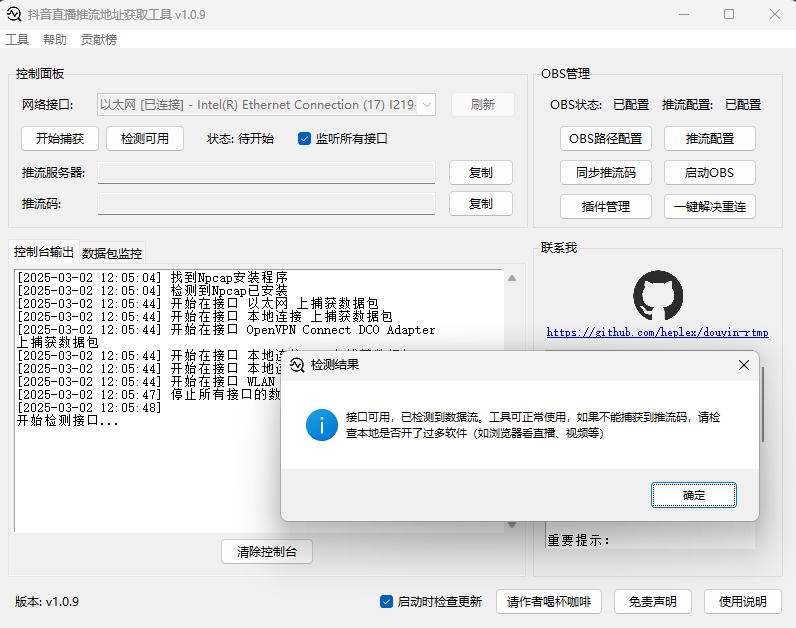
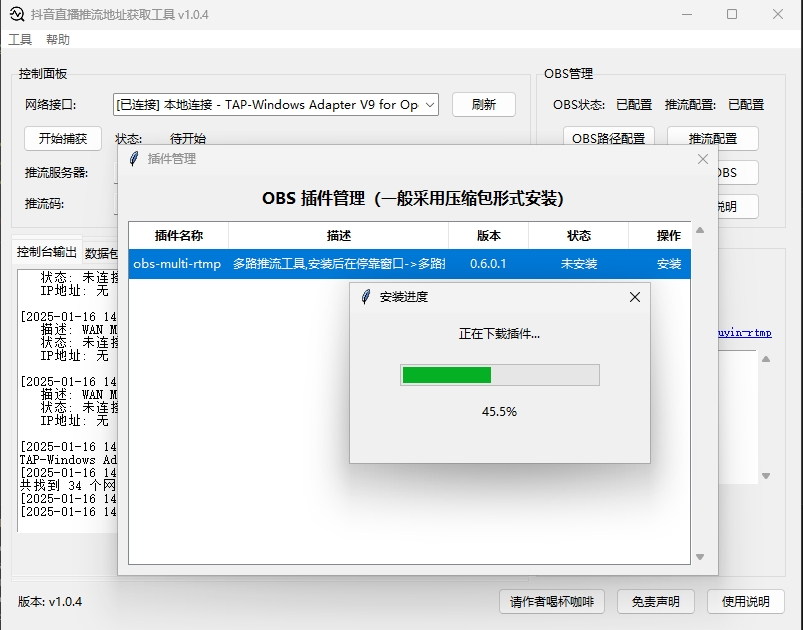

由于特殊情况，本项目缓慢更新/修复问题


# 抖音直播推流地址获取工具

一款基于 python3.12 开发、Npcap 进行网络抓包的抖音直播推流地址获取工具
获取到推流地址后，可以通过 obs 等直播工具进行抖音直播

## 免责说明

1. 本软件仅用于个人学习和测试使用，无需提供任何代价，并不可用于任何商业用途及目的（包括二次开发）；
2. 工具仅抓取公开传输的明文数据，未采用破解加密、伪装身份等技术手段；
3. 使用者需遵守抖音平台规定，若抖音平台禁止使用第三方工具，请立即停止工具的使用并删除工具；
4. 若本工具有造成任何可能的侵权行为，请进行联系，将会立即停止可能的侵权行为，并关闭代码仓库；
5. 本工具将根据抖音平台协议进行技术调整，确保合法合规；


## 界面展示

### 使用界面



### 插件管理界面




## 使用说明

### 视频教程

https://www.bilibili.com/video/BV1XFrjYGEQ4

### 使用环境

Windows 10 及以上版本，低版本 Windows 未进行验证过，也许可行？
需关闭杀毒软件或加入白名单

### 使用说明

#### 推流码获取

1. 本工具使用了网络抓包技术，可能会被杀毒软件误报，在下载时请关闭所有的杀毒软件或将本软件加入到白名单中，如 360、腾讯管家、火绒、windows defender 等;
2. 下载方式
   1. 在[Releases](https://github.com/heplex/douyin-rtmp/releases)页面选择喜欢的版本，点击 douyin-rtmp.exe 进行下载；
   2. 直接点击下载[douyin-rtmp.exe](https://github.com/heplex/douyin-rtmp/releases/latest/download/douyin-rtmp.exe)
   3. 国内用户代理下载地址[https://gh-proxy.com/github.com/heplex/douyin-rtmp/releases/latest/download/douyin-rtmp.exe](https://gh-proxy.com/github.com/heplex/douyin-rtmp/releases/latest/download/douyin-rtmp.exe)
3. 下载完成后，使用管理员权限进行运行；
4. 使用本软件，则默认同意软件内的免责声明;
5. 如果未检测到 Npcap，会提示先安装 Npcap，安装完成后，重新启动软件；
6. 选择对应的网络接口，有线网卡优先，如果未检测到，请手动选择；
7. 点击“开始捕获”按钮，开始捕获抖音直播推流地址；
8. 打开直播伴侣进行开播，推流地址会自动获取，并显示在软件中；
9. 如果推流地址获取失败，请检查网络接口是否选择正确，以及直播伴侣是否正常开播；
10. 如果仍然失败，可以尝试在工具重新安装 Npcap，并重新启动软件；

#### OBS 管理面板

1. OBS 路径配置

   - 点击后选择 OBS 安装目录下的 obs64.exe 文件
   - 配置成功后状态会显示"已配置"

2. 推流配置

   - 点击后选择 OBS 配置文件夹中的 service.json 文件
   - 文件位置：
     用户目录/AppData/Roaming/obs-studio/basic/profiles/
   - 一般只有一个文件夹，多个的情况下请自行区分，点进去以后
     选择 service.json 文件
   - 配置成功后状态会显示"已配置"

3. 同步推流码

   - 需要先完成 OBS 路径配置
   - 点击后会自动同步推流码到 OBS 配置文件中

4. 启动 OBS

   - 需要先完成 OBS 路径配置
   - 点击后会自动启动 OBS 程序
   - 已经获取推流码的情况下会自动进行同步推流码

5. 插件管理

   - 点击后会打开插件管理面板
   - 仅可安装和卸载插件列表所支持插件
   - 一般采用压缩包形式安装，安装后需重启 obs
   - 如果有好用的插件，可以进群里反馈，加到列表中

6. 注意事项
   - 首次使用请先配置 OBS 路径
   - 确保 OBS 已正确安装并运行过
   - 所有配置会自动保存，下次启动软件时自动加载

#### 插件列表

**to 插件作者：如果不喜欢自己的插件在列表中，可以联系删除**

[插件列表配置文件](https://github.com/heplex/douyin-rtmp/blob/config/config.json)


### 卸载

1. 在工具选项下，点击卸载 Npcap，卸载完成后，删除本软件即可；

### 交流群

唯一群，满人以后不再建新群
QQ 群：870101332

## 更新日志

1. 2025.01.06 v1.0.0
   1. 更新获取推流地址以及推流功能
2. 2025.01.06 v1.0.1
   1. 重构代码，调整项目结构
   2. 优化界面操作逻辑以及界面布局
   3. 优化抓包匹配正则
   4. 增加更新检测
   5. 优化 Npcap 安装
3. 2025.01.07 v1.0.2
   1. 增加 OBS 自动更新配置
   2. 去掉免责弹窗，增加用户体验
   3. 优化界面布局
4. 2025.01.10 v1.0.3
   1. 修复了推流码获取失败的问题
   2. 调整更新信息
5. 2025.01.16 v1.0.4
   1. 增加了OBS插件管理功能，可以一键安装多端推流插件等
   2. 增加了推流码同步按钮
6. 2025.01.18 v1.0.5
   1. 优化网络接口选择以及状态判断，减少了大量无用接口；
   2. 增加全部监听接口选项，解决选择困难症；
   3. 增加可选是否启动更新检测以及手动更新检测；
   4. 增加帮助中心；
   5. 增加贡献榜；
7. 2025.01.21 v1.0.6
   1. 增加OBS路径、推流配置文件自动检测配置；
   2. 修复缺少参数时，启动更新失效问题；
8. 2025.02.11 v1.0.7
   1. 修复v1.0.6版本中存在的网络接口可能获取错误问题；
9. 2025.02.13 v1.0.8
   1. 修复全部捕获时，无用网卡导致所有网卡捕获失效问题；
10. 2025.03.02 v1.0.9
    1.  增加一键解决obs重连；
    2.  优化捕获逻辑，支持开播后再捕获；
    3.  增加可用检测；

## 开发指南

### 目录结构

```
project
├── main.py                # 主入口
├── resources
│   └── npcap-1.80.exe    # Npcap安装程序
├── core
│   ├── capture.py        # 数据包捕获
│   └── npcap.py          # Npcap管理
├── gui
│   ├── main_window.py    # 主窗口
│   └── widgets.py        # GUI组件
└── utils
    ├── logger.py         # 日志管理
    ├── network.py        # 网络接口
    └── system.py         # 系统工具
```

### 项目启动

**1.对于 Windows11 24H2 以下的系统，以管理员身份运行 cmd 并执行以下命令**

```
pip install -r requirements.txt
python main.py
```

**2.对于 Windows11 24H2 及以上的系统，以任意身份运行 cmd 并执行以下命令**

```
pip install -r requirements.txt
sudo python main.py
```

### 打包命令

发行版默认采用 Pyinstaller 进行打包

**1.Pyinstaller**

- 优势：打包时间短
- 缺点：运行效率较低
- 原理：将 Python 环境与项目整合打包，使其能够在没有部署 Python 环境的设备上运行

```
build.bat -y
```

**2.Nuitka**

- 优势：运行效率高，相当于原生 C 语言程序
- 缺点：打包时间极长，可能存在环境问题导致打包失败
- 原理：将 Python 代码转换为 C 代码并使用 MinGW64 进行编译、静态链接，使其能够真正脱离 Python 环境运行

```
build.bat -y nuitka
```

## 请作者喝杯咖啡？

多少都是心意，一分也是对我莫大的鼓励！谢谢您的支持！


## Star History

[](https://star-history.com/#heplex/douyin-rtmp&Date)
